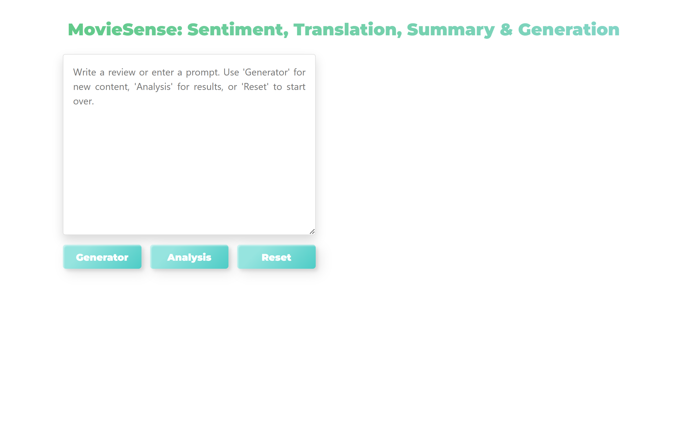
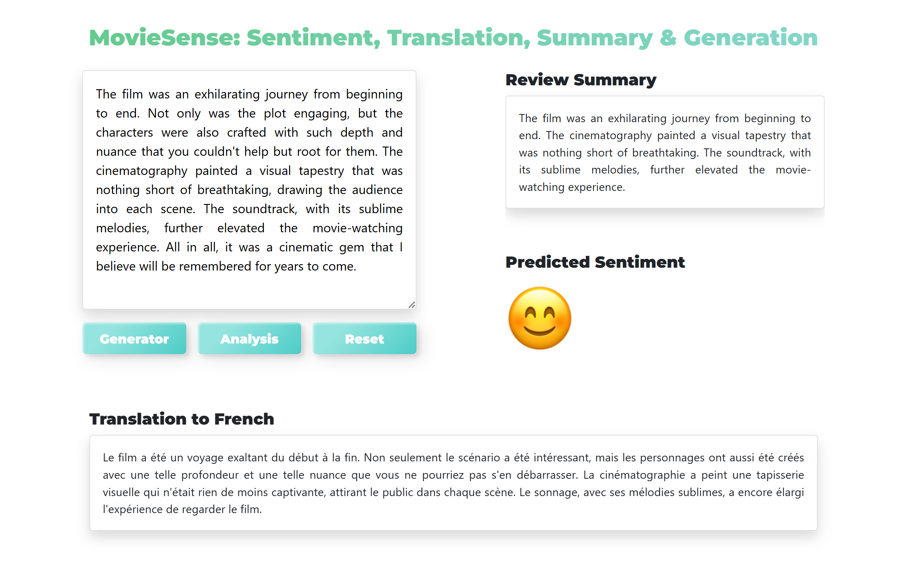
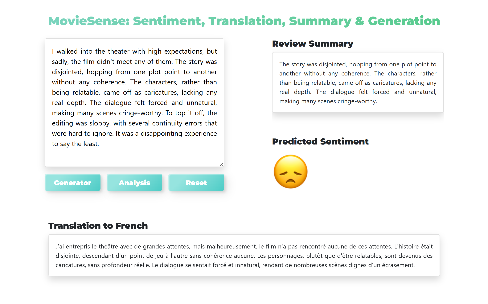
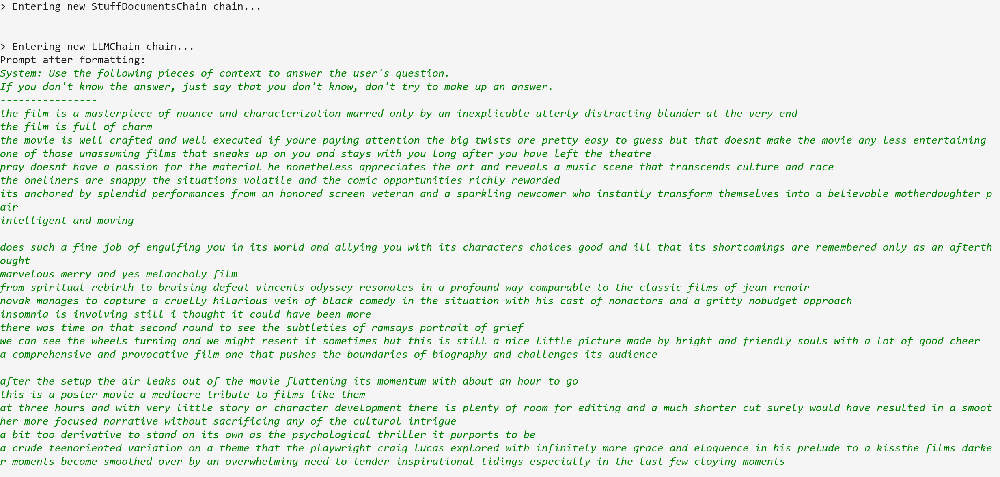
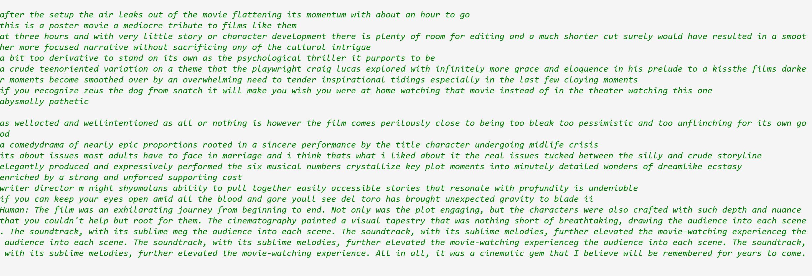
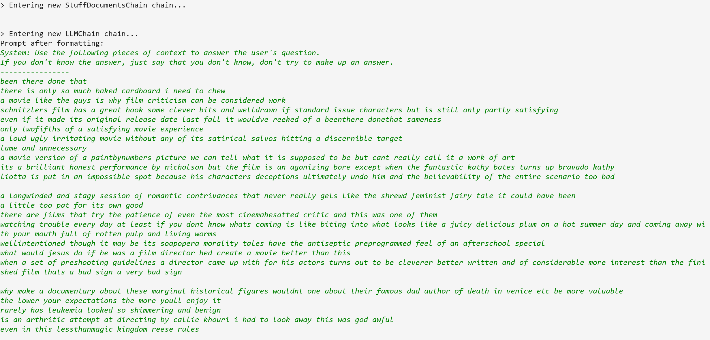
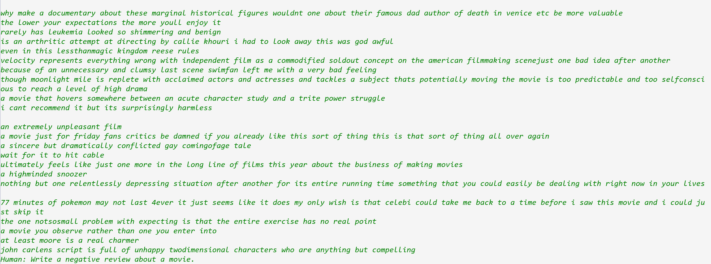

<h1>MovieSense: Sentiment Analysis, Translation, Summarization, and Text Generation</h1>

Welcome to <b>MovieSense</b>, an advanced Natural Language Processing (NLP) project 
designed to analyze and enhance movie reviews using state-of-the-art AI techniques. 
This project offers a comprehensive suite of services, including sentiment analysis, translation, summarization, 
and text generation, specifically tailored for movie review data.

 
  
## Table of Contents

Navigate through this `README.md` to learn more about the project, its features, setup, and future plans.

## Table of Contents

### 1. Overview and Features
1.1 [Overview](#overview)  
1.2 [Project Composition Diagram](#project-composition-diagram)  
1.3 [Features and Advantages](#features-and-advantages)  

### 2. Technologies and Models
2.1 [Technologies Used](#technologies-used)  
2.2 [Models and Methods Used](#models-and-methods-used)  
   - 2.2.1 [Archived Models](#archived-models)  

### 3. Problem Solving and Outcomes
3.1 [Issues and Solutions](#issues-and-solutions)  
3.2 [Expected Outcomes and Application Areas](#expected-outcomes-and-application-areas)  

### 4. Contributions and Execution
4.1 [Your Contribution](#your-contribution)  
4.2 [Project Timeline](#project-timeline)  

### 5. Installation
5.1 [Installation](#installation)  
   - 5.1.1 [Optional: Setting Up a Virtual Environment](#optional-setting-up-a-virtual-environment)  

### 6. Usage
6.1 [Usage](#usage)  
   - 6.1.1 [Setting the Output Location for Text Generation](#setting-the-output-location-for-text-generation)  
   - 6.1.2 [Additional Tips](#additional-tips)  
   - 6.1.3 [Limitations](#limitations)  

### 7. Performance and Future Work
7.1 [Results and Performance](#results-and-performance)  
7.2 [Future Scope](#future-scope)  

### 8. Additional Resources
8.1 [Page Screenshots](#page-screenshots)  
8.2 [References and Further Readings](#references-and-further-readings)  
 

# 1. Overview and Features
## 1.1 Overview
<!--1. Starting with a general overview provides readers with a quick understanding of what the project is about. -->

<b>MovieSense</b> is an advanced NLP-powered application designed for in-depth analysis and enhancement of movie reviews 
using cutting-edge AI techniques. By leveraging state-of-the-art NLP models like BERT, mBART, BART, and GPT-2, 
<b>MovieSense</b> provides a robust toolset for sentiment analysis, translation, summarization, and text generation. 
Users can classify reviews as positive or negative, translate reviews from English to French, 
generate concise summaries, and create new, contextually relevant reviews based on specific prompts.  
These NLP tasks were chosen because they address key aspects of understanding and interacting with movie reviews: 
sentiment analysis helps capture the audience's emotional response, translation expands accessibility 
for non-English-speaking users, summarization condenses lengthy reviews for quick insights, 
and text generation offers a creative way to explore potential reviews.  
While this project focuses on English to French translation to leverage well-established datasets and models, 
my personal interest in translation and improving NLP models, 
particularly to create more natural translations between languages like English and Korean, 
inspired the inclusion of these tasks. 
This serves as a foundation for future work in developing more nuanced translation systems for other language pairs.  
Tailored for movie enthusiasts, critics, and NLP researchers, 
<b>MovieSense</b> aims to enrich the movie review experience and offers valuable insights through AI-driven methodologies. 
Future plans include expanding translation support, integrating with online platforms for automated analysis, 
and exploring more advanced models for enhanced performance. 
Additionally, the techniques demonstrated in <b>MovieSense</b> have applications in broader fields 
like marketing, customer feedback analysis, and content moderation, 
highlighting the adaptability and potential impact of this project.

 

## 1.2 Project Composition Diagram

The following diagram provides an overview of the architecture and components of the **MovieSense** project:

*The diagram illustrates the flow of data through various components such as the NLP pipeline, models used for sentiment analysis, translation, summarization, and text generation, and the backend/frontend integration.*

Stay tuned for updates!

 

## 1.3 Features and Advantages
<!-- 2. Highlighting the unique aspects and benefits of your project early on helps readers see its value and 
why they should be interested. -->
1. **Sentiment Analysis**
   - Classifies movie reviews as positive or negative using a pre-trained BERT model (`distilbert-base-uncased-finetuned-sst-2-english`), trained on Rotten Tomatoes data.

2. **Translation**
   - Translates reviews from English to French using the mBART model, demonstrating the handling of multilingual NLP tasks.

3. **Summarization**
   - Generates concise summaries of reviews with Facebook's BART model, effectively capturing the core content.

4. **Text Generation**
   - Produces movie reviews based on user prompts with GPT-2, enhanced by Retrieval-Augmented Generation (RAG) for contextual accuracy.
   

# 2. Technologies and Models
 
## 2.1 Technologies Used
<!-- 3. After understanding the benefits, readers can see the tools and technologies you used to achieve those advantages. -->
- **Languages:** Python
- **NLP Techniques & Models:**
  - **Sentiment Analysis:** BERT
  - **Translation:** mBART 
  - **Summarization:** BART 
  - **Text Generation:** GPT-2, currently using the base pre-trained model to generate movie reviews based on specific prompts.
- **Frameworks/Libraries:**
  - **NLTK**: Used for text processing tasks and basic NLP utilities.
  - **Transformers**: Core library for NLP models such as BERT, GPT-2, BART, and mBART.
  - **Flask**: Backend development framework used to build and deploy web services for the project.
- **Frontend:** HTML, CSS, JavaScript for user interface development.
 

## 2.2 Models and Methods Used
<!-- 4. This section dives deeper into the specifics of the models and methods, providing more technical readers with detailed insights. -->
The project utilizes several state-of-the-art NLP models and methods, each tailored to specific tasks for analyzing and generating movie reviews. These models were selected for their effectiveness, performance, and suitability for the required NLP tasks. Below is a summary of the models and methods used:
  
1. **BERT (Bidirectional Encoder Representations from Transformers), 2018**  

   - **Model Used**: `distilbert-base-uncased-finetuned-sst-2-english`  
   
   - **Purpose**: Sentiment analysis to classify movie reviews as positive or negative.  
   
   - **Details**: A smaller, faster version of BERT fine-tuned on the SST-2 dataset, 
   designed to understand the context of words for accurate sentiment classification.
     

2. **mBART (Multilingual BART), 2020**  
   
   - **Model Used**: `facebook/mbart-large-50-many-to-many-mmt`  
   
   - **Purpose**: Translation of movie reviews into French to support multilingual audiences.  
   
   - **Details**: A sequence-to-sequence transformer model tailored for many-to-many translation tasks, 
   enhancing accessibility by translating content from English to multiple languages.
     

3. **BART (Bidirectional and Auto-Regressive Transformers), 2019**  
   
   - **Model Used**: `facebook/bart-large-cnn`  
   
   - **Purpose**: Summarization of extended movie reviews.  
   
   - **Details**: Combines a bidirectional encoder with an autoregressive decoder to produce high-quality summaries 
   that capture the essence of longer texts.
     

4. **GPT-2 (Generative Pre-trained Transformer 2), 2019**  
   
   - **Model Used**: `gpt2` (Hugging Face Transformers)  
   
   - **Purpose**: Baseline text generation based on user prompts.  
   
   - **Details**: Utilized as a baseline model for generating movie reviews. The pre-trained model 
   from Hugging Face Transformers serves as a comparison against more advanced text generation techniques.
     

5. **Retrieval-Augmented Generation (RAG) with GPT-3.5-turbo, 2023**  

   - **Model Used**: `gpt-3.5-turbo` (Accessed via OpenAI API) with retrieval methods  

   - **Purpose**: To generate contextually relevant text by retrieving and using relevant information 
   from a knowledge base before generating the output.  

   - **Details**: This approach combines the GPT-3.5-turbo language model, accessed through the OpenAI API, 
   with a retrieval mechanism that uses `all-MiniLM-L6-v2` embeddings and the `Chroma` vector database. 
   When a user provides a prompt, the system first retrieves the most relevant documents using similarity search in `Chroma`. 
   The retrieved documents are then used to guide the GPT-3.5-turbo model 
   to produce more accurate and context-aware text outputs.  
   
   **Note**: The OpenAI API key is required to access the GPT-3.5-turbo model, and usage of the API may incur costs depending on your OpenAI subscription plan.
     

6. **Sentence Embedding Model, 2020**  
   
   - **Model Used**: `all-MiniLM-L6-v2` (Sentence Transformers)  
   
   - **Purpose**: To create dense vector embeddings for similarity search in the RAG approach.  
   
   - **Details**: Generates embeddings for efficient similarity searches, supporting the RAG model by providing relevant context for text generation.
     

7. **Vector Database and Similarity Search, 2023**  
   
   - **Tool Used**: `Chroma` (Vector Database)  
   
   - **Purpose**: To store document embeddings and perform fast similarity searches for the RAG approach.  
   
   - **Details**: Facilitates the retrieval of relevant documents, enhancing the contextual accuracy of text generated by the RAG model.
  

### 2.2.1 Archived Models
The following models were previously used in this project but have since been archived in favor of more advanced approaches. Below is a summary of the archived models and their roles in the project:
  

1. **Naive Bayes**
   
   - **Purpose**: Used for Sentiment Analysis to classify movie reviews as positive or negative.  
   
   - **Details**: Implemented using traditional machine learning techniques for sentiment classification. 
   This method has been archived in favor of BERT, which provides more accurate and context-aware sentiment analysis due to its transformer-based architecture.
     
2. **Helsinki-NLP**
   
   - **Purpose**: Used for Translation of movie reviews into French to support multilingual audiences.  
   
   - **Details**: A collection of translation models from the OPUS-MT project. 
   These models were initially used for translation but have been replaced by mBART, 
   which supports more languages and provides better translation quality 
   due to its sequence-to-sequence transformer architecture.

The archived implementations can be found in the `archive` directory of the project for reference purposes.
 
 

# 3. Problem Solving and Outcomes

## 3.1 Issues and Solutions
<!-- 5. Discussing the challenges faced and how you solved them adds depth to your project's story 
and demonstrates problem-solving skills.-->
Stay tuned for updates!

 

## 3.2 Expected Outcomes and Application Areas
<!-- 6. Explaining the potential impact and real-world applications shows the relevance and utility of your work. -->
Stay tuned for updates!

 

# 4. Contributions and Execution
## 4.1 Your Contribution
<!-- 7. Clearly states your role and contributions, which is especially important for job applications. -->
As the sole developer of <b>MovieSense</b>, I was responsible for the entire project lifecycle, including:

1. **Project Design and Architecture**: Conceptualized the overall structure of the NLP pipeline 
to handle multiple tasks such as sentiment analysis, translation, summarization, and text generation.

2. **Model Selection, Implementation, and Optimization**: Selected appropriate pre-trained models 
(e.g., DistilBERT, mBART, BART, GPT-2) based on task requirements and integrated them into the project using the Hugging Face Transformers library. 
Utilized techniques such as Retrieval-Augmented Generation (RAG) to enhance the contextual relevance and accuracy of text generation. 
For specific details, refer to the [Models and Methods Used](#models-and-methods-used) section.

3. **Data Preparation and Evaluation**: Loaded, labeled, and shuffled movie review datasets for sentiment analysis. 
Implemented evaluation metrics to assess model performance and ensure robust results.

4. **Evaluation and Metrics**: Evaluated model performance using metrics such as BLEU, 
and iteratively improved models based on these results.

5. **Integration and Deployment**: Developed the backend using Flask and integrated the NLP models 
into a cohesive application. Designed a user-friendly frontend using HTML, CSS, and JavaScript for deployment.

6. **Documentation**: Created comprehensive documentation, including this `README.md`, 
detailing the project's features, models, installation, usage, and future scope.

This end-to-end approach demonstrates my ability to design, develop, and deploy complex NLP systems 
while continuously optimizing them for better performance.
  

## 4.2 Project Timeline
<!-- 8. Provides context for the development process and how the project evolved over time. -->
- **October 6, 2023**  
  - Created the initial web template for the MovieSense interface.

- **October 7-8, 2023**  
  - Implemented translation from English to French.
  - Added Bootstrap styling for improved UI/UX and made final styling adjustments.
  - Developed initial Sentiment Analysis and Summarization features using Transformer models.
  - Introduced a Reset button to clear inputs and adjusted page styles.

- **Mid-October 2023**  
  - Trained models using a new dataset to improve performance.

- **August 22-24, 2024**  
  - Updated **requirements.txt** for dependency management.
  - Enhanced Sentiment Analysis by replacing Naive Bayes with a pre-trained BERT model.
  - Switched the translation method to use the mBART model.

- **August 27, 2024**  
  - Refactored text generation to use `max_new_tokens` for better output control and excluded the prompt message.
  - Integrated GPT-2 model for initial text generation.

- **August 29-31, 2024**  
  - Refactored project structure: Separated `main_movie_sense.py` into individual modules for Sentiment Analysis, Text Generation, Summarization, and Translation.
  - **Implemented RAG-based text generation using LangChain for improved contextual relevance.**

- **September 1, 2024**  
  - Added `.env` file for OpenAI API key configuration and updated `.gitignore` to exclude it.
  - Updated **requirements.txt** to include necessary dependencies.

- **Current Status (September 2, 2024)**  
  - Preparing to finalize the evaluation metrics for text generation using BLEU scores.
  - Completed updates to README.md for clarity and completeness.

### Next Steps
- Include BLEU score evaluation results for text generation metrics to complete the project documentation.

 

# 5. Installation
## 5.1 Installation
<!-- 9. After understanding the project, readers might want to try it out. Having the installation instructions here makes sense. -->
Follow these steps to set up **MovieSense** on your local machine:

1. **Clone the repository**: Clone the project repository from GitHub to your local machine. 
  `git clone https://github.com/yjyuwisely/MovieSense_NLP.git`

2. **Navigate to the project directory**: Move into the source directory where the application code resides. 
  `cd MovieSense_NLP/src`

3. **Create an `.env` file for environment variables**: Create a `.env` file in the `src` directory to store your OpenAI API key  . 
   - Open a terminal or text editor and create a new file named `.env`: 
   `touch .env`

   - Add your OpenAI API key to the `.env` file in the following format: 
   `OPENAI_API_KEY=your_openai_api_key_here` 
   Replace `your_openai_api_key_here` with your actual OpenAI API key.

4. **Install the required packages**: Install all necessary Python packages and dependencies listed in `requirements.txt`. 
  `pip install -r ../requirements.txt`

5. **Run the main script**: Start the Flask web application by running the following command: 
  `python app.py`
   - **Expected Output**: You should see output in the terminal indicating that the Flask server is running, 
   e.g., Running on `http://127.0.0.1:5000/`.

6. **Access the application**: Open a web browser and navigate to the following URL to use **MovieSense**: 
  `http://127.0.0.1:5000/`
   - **Expected Outcome**: You should see the **MovieSense** interface where you can use features 
   like sentiment analysis, translation, summarization, and text generation.
 

### 5.1.1 Optional: Setting up a virtual environment
While the project can run without a virtual environment, it's highly recommended to use one for package isolation and to avoid conflicts with other Python projects.

1. **Install `virtualenv`**: If you don't have `virtualenv` installed, run the following command: 
   `pip install virtualenv`

2. **Clone the repository**: If you haven't already, clone the repository from GitHub: 
   `git clone https://github.com/yjyuwisely/MovieSense_NLP.git`

3. **Navigate to the project directory**: Move into the project directory where the virtual environment will be set up. 
   `cd MovieSense_NLP`

4. **Create a virtual environment**: Create a new virtual environment named `.env` 
   `virtualenv .env`

5. **Activate the virtual environment**: Activate the environment depending on your operating system:
   - On **macOS** and **Linux**:  
     `source .env/bin/activate`
   - On **Windows**:  
     `.\.env\Scripts\activate`

6. **Install dependencies and run the application**: Now, navigate to the `src`
directory and follow steps 3 to 5 from the [Installation section](#installation) to 
install the required packages, and run the application.

7. **Deactivate the virtual environment**: When you are done working on the project, deactivate the virtual environment using: 
   `deactivate`
 

# 6. Usage
## 6.1 Usage
<!-- 10. Explains how to use the project after it is set up, logically following the installation steps. -->

Follow the instructions below to use the features of **MovieSense** on the web interface:

1. **Analysis Button**  
   - **Description**: The **"Analysis"** button performs three tasks simultaneously:  
     - **Sentiment Analysis**: Classifies the input movie review as 'positive' or 'negative' using the DistilBERT model (`distilbert-base-uncased-finetuned-sst-2-english`). The result is represented with an emoji (😊 for positive, 😞 for negative).
     - **Translation**: Translates the input movie review from English to French using the mBART model (`facebook/mbart-large-50-many-to-many-mmt`).
     - **Summary**: Generates a concise summary of the input movie review using the BART model (`facebook/bart-large-cnn`).

   - **How to Use**:  
     - Enter a movie review in the input text box.
     - Click the **"Analysis"** button. The system will:
       - Display the predicted sentiment with an emoji.
       - Provide the French translation below the input box.
       - Show the summarized version of the review on the right side of the webpage.
 
       
2. **Generator Button**  
   - **Description**: The **"Generator"** button generates a new movie review based on a specific sentiment using the Retrieval-Augmented Generation (RAG) approach with the GPT-3.5-turbo model.
   - **How to Use**:  
     - Click the **"Generator"** button. You will be prompted to select either "Write a positive review about a movie" or "Write a negative review about a movie."
     - The generated movie review, based on your chosen sentiment, will appear in the input text box.
 
     
3. **Reset Button**  
   - **Description**: The **"Reset"** button clears all input fields, allowing you to start a new analysis or generate a new review.
   - **How to Use**:  
     - Click the **"Reset"** button to clear the input text box and reset the page to its default state.'     

 

### 6.1.1 Setting the Output Location for Text Generation

By default, the text generation using the GPT-3.5-turbo model outputs the result in the terminal. If you want the output to be displayed directly in the text box on the webpage:

- **To Display Output in the Web Interface**:  
  Modify the code in the `text_generation_rag_lanchain.py` file by commenting out the terminal-based output section and uncommenting the `generate_text` function. This change will enable the output to be displayed on the web interface.

- **To Display Output in the Terminal**:  
  Ensure the terminal-based output section in `text_generation_rag_lanchain.py` is active, and comment out the `generate_text` function.

For more details, refer to the [`text_generation_rag_lanchain.py`](src/nlp/text_generation_rag_lanchain.py) file in the repository.

 

### 6.1.2 Additional Tips

- **Ensure Proper Configuration**: Make sure you have set up your `.env` file with the OpenAI API key before using the text generation feature.
- **Internet Connection Required**: An internet connection is necessary to access the OpenAI API for text generation.

 
 
### 6.1.3 Limitations

- **Text Generation Feature**: The text generation feature using the OpenAI API requires a paid subscription to access the GPT-3.5-turbo model. Users will need their own API key with an active subscription to enable this feature.

  

# 7. Performance and Future Work
## 7.1 Results and Performance
<!-- 12. Presents the results and evaluation metrics after readers know how the project works. -->
<!-- This section will be updated soon to include the following:
- Evaluation metrics (e.g., accuracy, BLEU score, ROUGE score) for sentiment analysis, translation, summarization, and text generation.
- Sample outputs and comparisons with baseline models.
- Discussion on the performance and potential improvements. -->

### Text Generation Evaluation Metric: **BLEU** (Bilingual Evaluation Understudy Score)

To evaluate the effectiveness of the text generation models, the **BLEU** score is used. **BLEU** measures the precision of n-grams between the generated text and a reference text, assessing the fluency and accuracy of the generated movie reviews. This metric is particularly useful for evaluating the relevance and coherence of text generated by language models.

We evaluated two pre-trained models for text generation on movie reviews:

1. **Baseline GPT-2 Model**: A pre-trained GPT-2 model used without fine-tuning.
2. **RAG-Enhanced GPT-3.5-turbo**: A Retrieval-Augmented Generation approach combining document retrieval with GPT-3.5-turbo, used without fine-tuning.

#### BLEU Score Results:
- **Baseline GPT-2 Model**: X.X
- **RAG-Enhanced GPT-3.5-turbo**: Y.Y

### Discussion

The BLEU score comparison indicates that, even without fine-tuning, the RAG-enhanced GPT-3.5-turbo model outperforms the baseline GPT-2 model. This suggests that retrieval-augmented techniques can significantly improve the relevance and coherence of generated movie reviews. Future work could focus on fine-tuning these models to further enhance performance.
  

## 7.2 Future Scope 
<!-- 13. Outlines future improvements and extensions, which is a natural progression after discussing current results.-->
<!-- The next steps for your project, inspires confidence in its ongoing development, and can attract contributions or collaborations. -->
<!-- Potential Enhancements, New Features or Functionalities, Further Research, 
Long-Term Goals, Opportunities for Collaboration -->

- Extend translation support to other languages.

- Integrate with online platforms or databases for automated review analysis.

- Add user accounts to save and manage past reviews.

- **Optimize current model implementations for better performance**, such as:
  - Fine-Tuning pre-trained models on domain-specific datasets to improve performance for tasks like sentiment analysis, translation, and summarization.
  - Model Quantization to reduce model size and speed up inference, even when using pre-trained models.
  - Pruning to remove unnecessary parameters and decrease computational load, particularly useful during fine-tuning.
  - Efficient Batching and Data Loading to enhance data processing speed, applicable to both training and inference.
  - Using Mixed-Precision Training to improve training speed and reduce memory usage when fine-tuning models.
  - Hyperparameter Tuning to find the optimal settings for enhanced model performance, even for pre-trained models.
  - Caching and Pre-computation to minimize redundant calculations during inference, improving responsiveness.

- **Enhance prediction capabilities using advanced Deep Learning techniques**, such as:
  - Transfer Learning with larger pre-trained models for improved accuracy.
  - Reinforcement Learning from Human Feedback (RLHF) to refine text generation based on user preferences.
  - Knowledge Distillation to create efficient, smaller models for faster inference.
  - Attention Mechanisms and Transformer Variants (e.g., Longformer, BigBird) to handle longer sequences more effectively.
  - Self-Supervised Learning (SSL) to leverage large amounts of unlabeled data for robust model training.

- Implement free or local models for text generation, such as **T5, DistilGPT-2, and Local LLaMA**, to avoid reliance on paid APIs and reduce operational costs.

 

# 8. Additional Resources
<!-- Positive Sentiment Example:

Negative Sentiment Example:
 -->

## 8.1 Page Screenshots
<!-- 11. Placing the screenshots at the end serves as a visual summary and reinforces everything explained before.-->
Below are some screenshots of the **MovieSense** interface showcasing its key functionalities:

### Initial Web Page
 
*This screenshot displays the initial state of the **MovieSense** web interface 
before any input is provided. It shows the layout of the input text box and 
the main buttons (Analysis, Generator, Reset) available for user interaction.*

### Positive Sentiment Example
 
*This screenshot demonstrates a movie review analyzed by the **MovieSense** tool, showing a positive sentiment prediction along with the translated French version and a summarized output.*

### Negative Sentiment Example
 
*This screenshot demonstrates a movie review analyzed by the **MovieSense** tool, showing a negative sentiment prediction along with the translated French version and a summarized output.*

### Text Generation Output Example

Below are examples of text generated by the GPT-3.5-turbo model in the terminal:

#### Positive Review Output
 

 
*These screenshots show the output of a positive movie review generated using the GPT-3.5-turbo model via the terminal. Since I do not currently have a paid subscription to the OpenAI API, the generated text is displayed in the terminal rather than within the web interface.*

#### Negative Review Output
 

 
*These screenshots show the output of a negative movie review generated using the GPT-3.5-turbo model via the terminal. The terminal output illustrates how the model handles generating text for different sentiments.*

 

## 8.2 References and Further Readings
<!-- 14. Offers additional resources for readers who want to learn more or verify the information. -->
1. Artasanchez, A., & Joshi, P. (2019). *Artificial Intelligence with Python: Your complete guide to building intelligent apps using Python 3.x* (2nd ed.). Packt Publishing. 
[Available on Amazon](https://www.amazon.com/Artificial-Intelligence-Python-complete-intelligent/dp/183921953X) 
2. Lamons, M., Kumar, R., & Nagaraja, A. (2018) *Python Deep Learning Projects: 9 projects demystifying neural network and deep learning models for building intelligent systems* (1st ed.). Packt Publishing. 
[Available on Amazon](https://www.amazon.com/Python-Deep-Learning-Projects-demystifying/dp/1788997093) 
3. Seo, J. (2024). *Developing AI services based on LLM with LangChain*. Gilbut. (Written in Korean)  
[Available on GitHub](https://github.com/gilbutITbook/080413) 
4. Tunstall, L., von Werra, L., & Wolf, T. (2022) *Natural Language Processing with Transformers: Building Language Applications with Hugging Face* (1st ed.). O'Reilly Media. 
[Available on Amazon](https://www.amazon.com/Natural-Language-Processing-Transformers-Applications/dp/1098103246) 